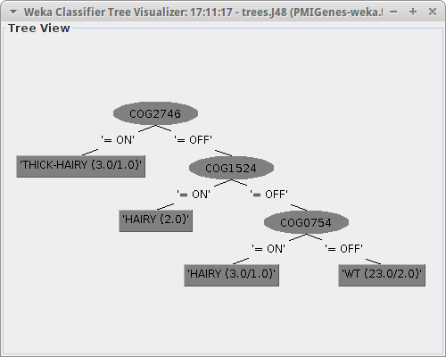

#Cashman Intern
Reserach notebook/results for PMI project.

###May
I have focued on using the Rhizobium data which has 31 genomes.  I have genome and biolog data.  For initial experiments I have generated a tree to 
predict the root morphology phenotype using the genes as attributes.  This was done before any data preprosessing.

